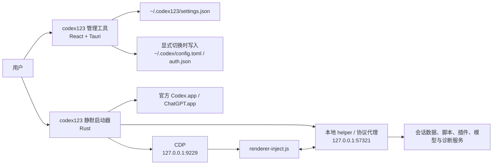

# codex123 开发交接文档

> 基线：`main` / `1fd514d` / `0.2.29`（2026-08-23）
>
> 仓库：`jzy5999-cpu/codex123`
>
> 主要维护目标：macOS Apple Silicon

本文面向接手开发、排障和发布的维护者。功能说明以 [README.md](../README.md) 为准；贡献约束以 [CONTRIBUTING.md](../CONTRIBUTING.md) 和 [AGENTS.md](../AGENTS.md) 为准；版本变化以 [CHANGELOG.md](../CHANGELOG.md) 为准。

## 1. 项目边界

`codex123` 是非官方 Codex App 外部增强工具，致敬并基于 `BigPizzaV3/CodexPlusPlus`。它由静默 launcher、Tauri 管理工具、本地 helper、CDP 注入脚本和会话数据层组成。

必须保持以下边界：

- 不修改 Codex App 原始安装文件，不修改 `app.asar`。
- 增强能力继续走外部 launcher、Chromium DevTools Protocol（CDP）和页面脚本注入。
- 远控兼容中转模式必须保护官方 ChatGPT 登录态；中转 Key 只进入 provider 配置，不写入 `auth.json` 的 `OPENAI_API_KEY`。
- 启动 Codex 时不得自动应用当前中转 profile，不得无提示重写 `config.toml` 或 `auth.json`。
- 默认只维护和发布 macOS Apple Silicon；没有明确需求时不要更新 Windows 代码、安装包或 Release 资产。
- 保留 `LICENSE`、`NOTICE`、`UPSTREAM.md`、`README.md` 和 `README_EN.md` 中的上游来源、致谢和独立项目声明。

## 2. 架构总览



### 2.1 Rust workspace

| 目录 | 职责 | 主要入口 |
| --- | --- | --- |
| `apps/codex-plus-launcher` | 单实例、定位并启动官方 App、启动 helper、CDP 注入、watchdog、退出清理 | `src/main.rs` |
| `apps/codex-plus-manager/src-tauri` | Tauri 后端、UI commands、配置切换、更新和安装操作 | `src/lib.rs`、`src/commands.rs` |
| `crates/codex-plus-core` | 启动、CDP、bridge、配置、协议代理、插件/脚本市场、更新、诊断等核心逻辑 | `src/lib.rs` |
| `crates/codex-plus-data` | 会话存储、备份/撤销、Markdown 导出、Provider Sync | `src/lib.rs` |

### 2.2 前端与注入层

| 文件 | 职责 |
| --- | --- |
| `apps/codex-plus-manager/src/App.tsx` | 管理工具主界面和 Tauri command 调用；当前仍是大型单文件组件 |
| `apps/codex-plus-manager/src/model-windows.ts` | 模型与上下文窗口的前端转换逻辑 |
| `assets/inject/renderer-inject.js` | 注入 Codex 主 renderer 的增强脚本、菜单、模型/插件兼容补丁和 bridge 客户端 |
| `crates/codex-plus-core/src/assets.rs` | 将注入脚本和运行时信息嵌入 Rust 二进制 |
| `crates/codex-plus-core/src/bridge.rs` | CDP binding 和 JavaScript bridge 注入 |
| `crates/codex-plus-core/src/routes.rs` | bridge/helper 路由及运行时、数据服务分发 |

## 3. 启动链路

默认端口：

| 端口 | 用途 |
| --- | --- |
| `57319` | 管理工具单实例 guard |
| `57320` | launcher 单实例 guard |
| `57321` | helper、bridge 后端和 Chat Completions/Responses 本地协议代理 |
| `9229` | Codex Chromium 远程调试/CDP |

正常启动顺序：

1. launcher 解析 `--app-path`、`--debug-port` 和 `--helper-port`。
2. 通过 `57320` 获取单实例 guard；已有实例时尝试激活现有 Codex 并恢复注入。
3. 从 `~/.codex123/settings.json` 读取启动和增强配置。
4. 如启用 Provider Sync，先同步会话 provider metadata。
5. 如启用增强或协议代理，启动仅监听 loopback 的 helper。
6. 定位 `/Applications/Codex.app`；找不到时可回退 `/Applications/ChatGPT.app`，也可使用管理工具保存的路径。
7. 以 CDP 参数启动官方 App，等待目标页面出现并注入 renderer script 和 bridge。
8. 注入成功写入 `running`；官方 App 已运行但注入暂未就绪时写入 `running_degraded`，不因此关闭官方 App。
9. bridge watchdog 在页面刷新或 renderer 变化后尝试恢复完整 `BridgeContext`。
10. 官方 App 退出后关闭 helper，并执行相应清理。

启动链路的关键实现位于：

- `crates/codex-plus-core/src/launcher.rs`
- `apps/codex-plus-launcher/src/main.rs`
- `crates/codex-plus-core/src/app_paths.rs`
- `crates/codex-plus-core/src/cdp.rs`

## 4. 配置与数据所有权

### 4.1 codex123 自有状态

| 路径 | 内容 | 是否可公开 |
| --- | --- | --- |
| `~/.codex123/settings.json` | 管理工具设置、供应商 profiles、启动参数 | 否，可能含 Key、URL 和本地路径 |
| `~/.codex123/latest-status.json` | 最近启动状态、端口和 App 路径 | 脱敏后可用于排障 |
| `~/.codex123/codex123.log` | JSONL 诊断日志，超过 50 MiB 时压缩保留尾部 | 脱敏后可用于排障 |

### 4.2 Codex 官方状态

| 路径 | 内容 | 维护规则 |
| --- | --- | --- |
| `~/.codex/config.toml` | provider、模型、feature、marketplace 等 | 只在用户明确应用/清除配置时修改；保留无关字段 |
| `~/.codex/auth.json` | 官方 ChatGPT 登录态及 API 模式字段 | RemoteRelay 不得写入中转 Key；不要覆盖实时官方账号 |
| `~/.codex/model-catalogs/` | 按供应商生成的模型目录 | 由模型窗口配置生成和维护 |
| `~/.codex/pets/` | 已安装宠物 | 只允许合法 slug 子目录和受控资源写入 |
| `~/.codex/.tmp/plugins-remote/` | 内置官方远端插件缓存释放位置 | 与 `config.toml` marketplace 注册状态分别核验 |

`CODEX_HOME` 和 `CODEX_SQLITE_HOME` 会影响部分 Codex 数据定位。修改路径逻辑时必须同时检查配置、Provider Sync、会话数据库、日志数据库和 thread reference 数据库，不能只修一个调用点。

## 5. 中转模式安全边界

`RelayMode` 包含 `Official`、`RemoteRelay`、`MixedApi` 和 `PureApi`。`RelayProtocol` 包含 `Responses` 和 `ChatCompletions`。

### RemoteRelay

目标是在使用中转请求的同时保留官方 ChatGPT 登录态和远控可见性：

- `config.toml` provider 使用 `wire_api = "responses"`。
- `requires_openai_auth = true`。
- 中转 Key 写入 provider 的 `experimental_bearer_token`。
- `auth.json` 的 `OPENAI_API_KEY` 必须为空或不存在，其他官方登录字段必须保留。
- 应用配置时以磁盘上的实时 `auth.json` 为基准，不使用 profile 中可能过时的官方账号快照覆盖它。

### PureApi

纯 API 模式允许将 API Key 写入 `auth.json`，但不得继承 RemoteRelay 专用的 `requires_openai_auth` 或 `experimental_bearer_token`。两种模式的测试不能混用。

### 写入与回滚

- 用户点击应用/清除供应商配置才允许写 `config.toml` 和 `auth.json`。
- 写入前验证 TOML/JSON；写入失败时尽量恢复两个文件的原内容，避免只更新一半。
- 清除配置只移除 codex123 管理的字段和本地代理 URL，不覆盖用户自定义 provider 或其他通用配置。
- 日志、诊断导出、测试 fixtures 和提交内容不得出现真实 token、账号、Base URL 或私人路径。

主要实现和回归测试：

- `crates/codex-plus-core/src/relay_config.rs`
- `crates/codex-plus-core/src/settings.rs`
- `crates/codex-plus-core/src/protocol_proxy.rs`
- `crates/codex-plus-core/tests/relay_config.rs`
- `crates/codex-plus-core/tests/protocol_proxy.rs`

## 6. 常见修改入口

| 需求 | 首先检查 | 必须联测 |
| --- | --- | --- |
| Codex 页面结构或资源模块变化 | `renderer-inject.js`、`cdp.rs`、`bridge.rs` | `cdp_bridge.rs`、真实 Codex 主页面注入诊断 |
| 启动、重启或 App 定位 | `launcher.rs`、`app_paths.rs`、launcher `main.rs` | `launcher.rs` tests、真实进程和端口 |
| 中转/provider 配置 | `relay_config.rs`、`settings.rs`、`App.tsx` | relay 与 protocol proxy 全套测试、真实登录态保护 |
| 模型目录或 service tier | `model_catalog.rs`、`renderer-inject.js` | `model_catalog.rs` tests、`/backend/status`、UI 展示 |
| 会话移动、删除、撤销、导出 | `codex-plus-data`、launcher data service | storage/provider sync tests、多数据库候选路径 |
| 插件市场 | `plugin_marketplace.rs`、`renderer-inject.js` | source、cache、live description/inventory 三层证据 |
| 脚本市场 | `script_market.rs`、`user_scripts.rs`、`App.tsx` | 网络超时/重试、缓存回退、当前会话 reload |
| 更新与安装 | `update.rs`、`install/`、打包脚本 | 架构选择、bundle、签名、DMG、运行版本 |

## 7. 本地开发与验证

环境要求：Rust stable、Node.js/npm，以及 macOS 打包所需的 `sips`、`iconutil`、`codesign`、`hdiutil`。

首次安装前端依赖：

```bash
cd apps/codex-plus-manager
npm ci
```

常规检查：

```bash
cd apps/codex-plus-manager
npm run check
npm run vite:build

cd ../..
cargo fmt --check
cargo test
git diff --check
```

发布候选还应执行：

```bash
cargo build --release
BINARY_DIR="$PWD/target/release" bash scripts/installer/macos/package-dmg.sh <version> arm64
```

按改动范围补充真实运行验证：

- 两个 `.app` 的 bundle 版本、可执行文件名和 `codesign --verify`。
- launcher、manager、官方 Codex 和 helper 的实际进程，排除旧进程占用 `57321`。
- `POST http://127.0.0.1:57321/backend/status` 返回的版本与候选版本一致。
- 日志出现目标主页面的 `renderer.script_loaded`、bridge request/response 和预期补丁诊断。
- RemoteRelay 验证前后对比 `config.toml` 与 `auth.json`，确认官方登录字段未被替换。
- DMG 安装后的运行结果必须与源码构建结果分开记录，不能只验证 `target/release`。

## 8. 版本与发布流程

### 8.1 版本同步

正式版本至少同步：

- `Cargo.toml` 的 workspace version。
- `Cargo.lock` 中 workspace packages 的版本。
- `crates/codex-plus-core/src/version.rs`。
- `apps/codex-plus-manager/package.json` 和 `package-lock.json`。
- `apps/codex-plus-manager/src-tauri/tauri.conf.json`。
- `CHANGELOG.md` 的版本、日期、用户可感知变化和明确未合入范围。

可用以下命令查找残留旧版本：

```bash
rg -n '<旧版本>|<新版本>' Cargo.toml Cargo.lock apps crates CHANGELOG.md
```

### 8.2 本地 DMG

`scripts/installer/macos/package-dmg.sh` 会：

1. 清理并重建 `dist/macos`。
2. 生成 `.icns`。
3. 创建 `codex123.app` 和 `codex123 管理工具.app`。
4. 写入 bundle metadata 和 `PkgInfo`。
5. 执行 ad-hoc 签名和基本验证。
6. 生成 `dist/macos/codex123-<version>-macos-arm64.dmg`。

脚本只接受 `arm64`。当前没有 Apple Developer ID 签名或 notarization。

### 8.3 GitHub Release

`.github/workflows/release-assets.yml` 由 GitHub Release 的 `published` 事件触发，从 release tag 构建 macOS arm64 DMG，并上传静态 `latest.json`。

发布是外部不可逆操作，必须分阶段执行：

1. 确认工作树、分支、HEAD、版本号和变更范围。
2. 完成前端、Rust、敏感信息和本地 DMG 验证。
3. 提交并推送明确的 release commit。
4. 核对远端 commit/tag 指向。
5. 经用户明确确认后创建或发布 GitHub Release。
6. 等待 Actions 完成，核对 DMG 和 `latest.json`。
7. 下载 Release DMG，校验哈希、安装、签名、运行进程和 `/backend/status`。

任何阶段失败都应停止，不要跳过门槛继续发布。高权限动作若被自动审查拒绝，应请求手动审批，不要把问题误判为 App、DMG 或 GitHub 资产损坏。

## 9. 故障排查

### helper 端口不可用

```bash
lsof -nP -iTCP:57321 -sTCP:LISTEN
ps aux | rg 'codex123|Codex|ChatGPT'
curl -sS -X POST http://127.0.0.1:57321/backend/status \
  -H 'Content-Type: application/json' -d '{}'
```

先确认监听者的可执行文件和版本。旧 helper 占用端口时，源码、DMG 和 `/Applications` 中的版本可能不一致。

### `running_degraded`

表示官方 App 已启动，但 CDP 注入没有在重试窗口内就绪。依次检查：

1. `9229` 是否监听。
2. launcher 是否定位到了官方 `Codex.app`/`ChatGPT.app`，而非 codex123 自身 bundle。
3. CDP targets 中是否存在官方主页面。
4. 注入目标过滤是否错误选择 Quick Chat、内嵌浏览器或 Avatar Overlay。
5. `~/.codex123/codex123.log` 中最近的 `launcher.ensure_injection_retry_failed` 和 renderer/bridge 事件。

### 管理工具正常、页面功能超时

如果 `/backend/status` 正常但 Codex 页面功能超时，问题通常位于 CDP binding、renderer script 缓存或 bridge 重注入。检查 `renderer.script_loaded`、`bridge.request`、`bridge.response`，然后通过 codex123 重启官方 App。

### 中转后远控不可见

核对：

- `auth.json` 仍包含当前官方 ChatGPT 登录态，且没有中转 `OPENAI_API_KEY`。
- provider 的 `wire_api`、`requires_openai_auth`、`base_url` 和 `experimental_bearer_token`。
- `base_url` 是否指向预期上游或本地 `127.0.0.1:57321/v1` 协议代理。
- 当前运行 helper 是否为本次构建版本。

不要通过把中转 Key 写回 `auth.json` 来“修复”RemoteRelay，这会破坏模式边界。

## 10. 当前限制与维护风险

- macOS Apple Silicon 是唯一重点维护并实机验证的目标。
- DMG 仅 ad-hoc 签名，未使用 Apple Developer ID，也未 notarize。
- Windows 代码和构建链仍存在，但不随 macOS 版本默认更新，且缺少真实 Windows 全链路验证。
- CDP 注入依赖官方 App 的页面结构、资源模块和目标页面特征；官方更新后必须重新验证。
- 某些当前 Codex 版本只导出函数式 App Server 请求桥，旧客户端层不能安全替换时会跳过该层，继续依靠 Statsig、JSON 响应和 MCP 模型白名单补丁；这属于受控降级，不应强行做不安全替换。
- `App.tsx` 和部分 relay 测试文件较大，修改时应优先复用现有 helper，避免继续复制配置转换逻辑。
- 静态配置、缓存内容和 live service/inventory 是不同证据；验收时不能互相替代。

## 11. 上游同步原则

上游来源和选择性合入记录见 [UPSTREAM.md](../UPSTREAM.md)。同步 `BigPizzaV3/CodexPlusPlus` 时：

1. 先比较目标上游版本与当前 codex123 的真实差异。
2. 按功能选择性移植，不直接整分支覆盖。
3. 保留 codex123 品牌、RemoteRelay 登录态保护和 macOS 优先策略。
4. 默认排除上游赞助、广告、交流群、品牌内容，以及未经请求的 Windows、Dream Skin、VLM、Stepwise 等功能。
5. 对 Codex 兼容补丁同时检查源码、测试、实际资源模块和 live 诊断。
6. 在 `CHANGELOG.md` 明确写出合入项和未合入项。

## 12. 交接验收清单

接手者应能独立完成以下操作：

- 说明 launcher、manager、helper、CDP 和 renderer injection 的调用关系。
- 找到四个默认端口以及三个 `~/.codex123` 状态文件。
- 在不破坏官方登录态的前提下区分 RemoteRelay 与 PureApi。
- 运行前端检查、Rust 测试、release build 和 macOS DMG 打包。
- 从源码、DMG、`/Applications`、运行进程和 `/backend/status` 五个层面区分版本。
- 根据日志定位 helper、CDP target、bridge 和 renderer script 的故障层。
- 按版本同步清单更新版本，并在明确确认后执行 GitHub Release。
- 审查提交中的 token、账号、Base URL、本地隐私路径、日志和生成产物。

每次重要发布后，更新本文开头的基线，并复核架构、端口、配置路径、发布 workflow 和已知限制是否仍然准确。

## 13. 每次开发完成后的 HANDOFF 规则

本文是 codex123 的唯一规范开发交接文档。每次开发任务完成后，必须更新下面的“开发完成记录”；不限于正式发布。未更新交接记录时，不得把任务报告为已经完成。

每条记录至少包含：

```markdown
### YYYY-MM-DD — <任务名称>

- 目标：
- 变更文件：
- 行为变化：
- 验证命令与结果：
- Git 状态：分支 / HEAD / 是否提交 / 是否推送
- 构建与安装：源码构建 / DMG / `/Applications` / 运行版本
- 发布状态：未发布 / tag / Release / Actions / 资产验证
- 保留风险或未验证项：
- 下一步：
```

以下状态必须分开写，不能用其中一项代替另一项：代码检查通过、测试通过、已提交、已推送、DMG 已生成、已安装、运行 helper 已验证、GitHub Release 已发布。

若版本基线、默认端口、部署方式、与其他项目的关系或安全边界变化，还要同步更新 `/Users/jiangzengyan/Downloads/codex/DevSpace/HANDOFF.md`。

## 14. 开发完成记录

### 2026-08-23 — 建立持续交接机制

- 目标：把既有开发交接文档纳入每次开发的强制收尾流程。
- 变更文件：`AGENTS.md`、`docs/DEVELOPMENT_HANDOFF.md`；保留现有 `README.md` 和 `README_EN.md` 链接修改。
- 行为变化：无业务代码变化，只增加维护规范。
- 验证：检查 Markdown 结构、相对链接、`git diff --check` 和工作树范围。
- Git 状态：交接规则、本文和 README 链接纳入本次文档提交，并与 0.2.29 功能提交一并推送 `origin/main`。
- 构建与安装：不适用，未构建、未安装、未重启运行程序。
- 发布状态：未创建 tag 或 Release。
- 保留风险：本文是新建文件，后续开发必须继续按 `AGENTS.md` 追加实际完成记录，不能只更新版本标题。
- 下一步：下一次代码开发完成时追加新记录，并按实际状态更新本文开头基线。

### 2026-08-23 — 选择性同步上游稳定性修复并构建 0.2.29 候选

- 目标：审计 CodexPlusPlus `v1.2.48`-`v1.2.52`，在不扩大 Windows、微信、分享站、Stepwise、Dream Skin、VLM 或品牌范围的前提下，为当前 macOS Apple Silicon 版本合入与协议代理、Provider Sync、会话删除和 CDP 插件过滤直接相关的稳定性修复。
- 变更文件：`Cargo.toml`、`Cargo.lock`、`CHANGELOG.md`、`UPSTREAM.md`、`apps/codex-plus-launcher/src/main.rs`、manager 的 `package.json`/`package-lock.json`/`tauri.conf.json`、`assets/inject/renderer-inject.js`、`crates/codex-plus-core/src/protocol_proxy.rs`、`crates/codex-plus-core/src/version.rs`、相关 core/data 回归测试、`crates/codex-plus-data/src/provider_sync.rs`、`crates/codex-plus-data/src/storage.rs` 和本文；开始前已有 `AGENTS.md`、`README.md`、`README_EN.md` 与本文的新建文档改动均原样保留并纳入工作树审查。
- 行为变化：Responses 完成 usage 始终包含 `output_tokens_details.reasoning_tokens`；插件市场全局 filter 补丁先运行原过滤并缓存回调源码；Provider Sync 排除 rollout/SQLite 标记的 subagent、internal 和 memory-consolidation 线程；删除会话会原子清理 `session_index.jsonl`，undo 去重恢复被删索引行。
- 验证命令与结果：`node --check assets/inject/renderer-inject.js` 通过；`npm run check` 通过；`npm run vite:build` 通过；`cargo fmt --check` 通过；授权环境下 `cargo test` 全部通过；新增 protocol proxy 3 项、Provider Sync 1 项、session index 删除/撤销 1 项回归均通过；`git diff --check` 通过；差异敏感信息扫描未发现真实 `sk-`、access token、refresh token 或 Bearer token。
- Git 状态：0.2.29 功能提交为 `1fd514d`（`feat: release 0.2.29 stability fixes`）；HANDOFF 机制和 README 链接纳入随后的文档提交；两项均由本次任务推送 `origin/main`。
- 构建与安装：`cargo build --release` 通过；已生成 `dist/macos/codex123-0.2.29-macos-arm64.dmg`；最终 DMG SHA-256 为 `c5b22545ef0792a6b6167fc59c2086daa5394573dc78da94dee279dc32fd1ac8`；`hdiutil verify` 通过；镜像内两个 App 均为 `0.2.29`、Mach-O arm64、ad-hoc 签名有效；已将原 0.2.28 两个 App 备份到 `/tmp/codex123-install-backup-20260823-2200/`，并把 0.2.29 安装到 `/Applications/codex123.app` 和 `/Applications/codex123 管理工具.app`；安装后两个 App 的版本、arm64 架构和深度签名均复核通过。
- 发布状态：未创建 commit、tag、GitHub Release 或 Actions 构建；远端最新 Release 仍为 `v0.2.27`。
- Live 验证：仅停止旧 0.2.28 helper PID `3020`，未退出官方 ChatGPT；启动后新 helper PID `8987` 从 `/Applications/codex123.app/Contents/MacOS/codex123` 运行并监听 `127.0.0.1:57321`，官方 ChatGPT 保持原 PID `3026` 监听 `127.0.0.1:9229`；`latest-status.json` 为 `running` 且 `codex_app` 指向 `/Applications/ChatGPT.app`；`POST /backend/status` 返回 `status=ok`、`version=0.2.29`、`transport=http-helper`；新进程日志记录 `renderer.script_loaded version=0.2.29` 和持续 `backend/status=ok`；CDP 只读求值确认 session-delete bridge 为 function、App Server patch 版本 `5`、JSON patch `1`、MCP message patch 已安装、`modelPatchFailures=[]`。
- 保留风险或未验证项：Provider Sync 和删除功能只做了隔离临时目录回归，不对真实 `~/.codex` 执行写操作；本次为复用原官方 ChatGPT 进程的无损 live 验证，没有重新登录或修改官方认证文件；上游 Remote Recovery、OpenAI Remote session identity 和 hosted sharing 明确未合入；尚未创建 tag 或 Release。
- 下一步：用 `git ls-remote` 核对 `origin/main` 指向本次最终文档提交；tag 与 GitHub Release 仍需单独明确确认。
